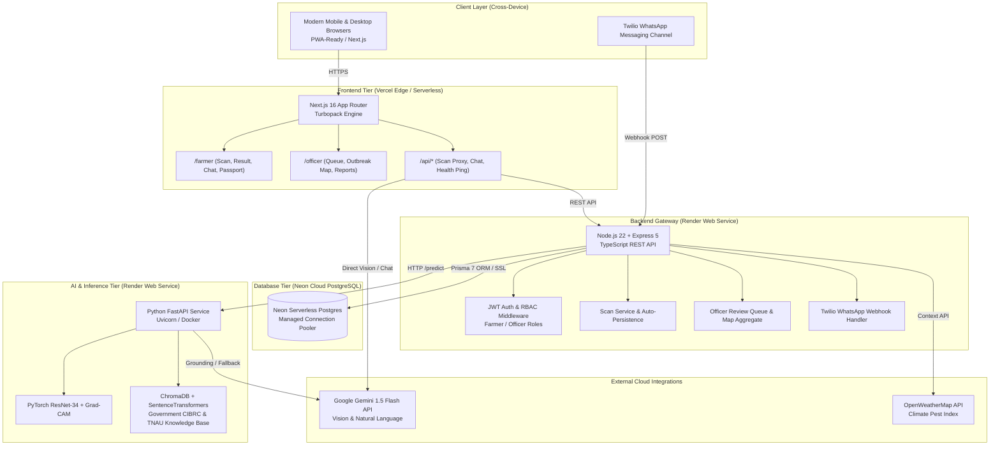

# 🏗️ AgriBharat / Krishi Darpan — System Architecture

## 1. System Topology

---

## 2. Tier Specifications

### A. Frontend Tier (Vercel)
* **Framework:** Next.js 16 (React 19) with Turbopack.
* **Styling:** Custom Vanilla CSS Design System with warm sunrise aesthetic, dynamic cards, glassmorphism, responsive dock, and mobile bottom navigation.
* **Bilingual Engine:** First-class Hindi, Marathi, and English support across all interactive widgets and reports.
* **Offline-Resilient Scanning:** Built with a 3-tier cascade (`/api/scan/analyze` ➔ backend proxy ➔ Gemini Vision ➔ client-side agronomic engine) ensuring the scan feature never fails, even during cold starts.

### B. Backend Tier (Render)
* **Runtime:** Node.js 22 with Express 5 and strict TypeScript compilation.
* **Database Access:** Prisma 7 with Postgres driver adapters.
* **Security:** JWT authentication with 7-day expiration, bcrypt password hashing, and role-based route guards (`FARMER`, `OFFICER`, `ADMIN`).
* **Officer Review Queue:** Scans with low confidence (<65%) or severe pathogen stages are automatically routed into the agricultural extension officer's triage queue.

### C. Database Tier (Neon PostgreSQL)
* **Provider:** Neon Serverless PostgreSQL with autoscaling and branching.
* **Schema Core Tables:**
  * `user`: Authentication records and role designations.
  * `farm`: Geo-tagged parcels, crop species, and acreage.
  * `scan`: Image references, coordinates, timestamps, and triage status.
  * `diseaseResult`: Diagnosed pathogens, confidence, foliar damage, and recommendations.
  * `review`: Officer feedback, verification badges, and adjusted spray instructions.
  * `chatMessage`: Multi-turn conversational history.

### D. Machine Learning Tier (Render / Python)
* **Framework:** PyTorch 2.6, FastAPI, and Uvicorn.
* **Core Tasks:**
  1. Leaf verification and non-foliage rejection (YOLOv8 + CIELAB).
  2. Multi-class crop disease classification (ResNet-34).
  3. Visual Explainable AI (Grad-CAM).
  4. Foliar damage percentage estimation.
  5. Vector retrieval-augmented generation (ChromaDB + SentenceTransformers).
