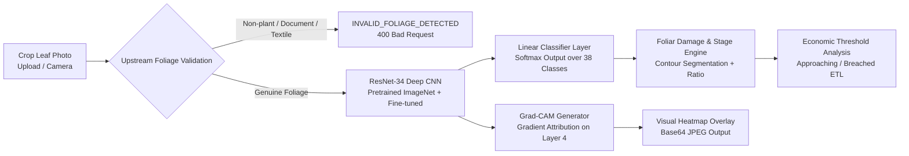

# 🔬 Computer Vision & Disease Inference Engine — Technical Documentation

## 1. Overview

The **AgriBharat Crop Vision Engine** delivers automated disease diagnostics, foliar damage estimation, Economic Threshold Level (ETL) classification, and visual Explainable AI (Grad-CAM) heatmaps across 16 major Indian crops.

---

## 2. Core Model Architecture

### Components:
1. **Primary Diagnostic Model**: PyTorch **ResNet-34** (`best_resnet34.pth`).
   * Architecture: 34-layer residual convolutional network.
   * Input: $224 \times 224 \times 3$ RGB normalized with standard ImageNet statistics.
   * Loss Function: Cross-Entropy with label smoothing.
2. **Explainable AI (Grad-CAM)**:
   * Target layer: `model.layer4[-1].conv2`.
   * Computes gradients of the target disease score with respect to convolutional feature activation maps.
   * Produces a visual heatmap overlay highlighting the exact necrotic lesions and pustules that drove the prediction.
3. **Upstream Foliage Rejection**:
   * Dual-layer check: YOLOv8 (`yolov8n.pt`) object detection + CIELAB chromatic dispersion.
   * Rejects non-plant images (documents, human faces, textiles, tools) before inference.
4. **Foliar Damage & Infection Stage**:
   * Analyzes percentage of leaf surface affected by necrotic tissue.
   * Categorizes infection into `Mild` (<10%), `Moderate` (10-25%), or `Severe` (>25%).
   * Calculates **Economic Threshold Level (ETL)** status to advise whether chemical spraying is economically justified.

---

## 3. Supported Crops & Pathogens

Covering 16 high-value staple, cash, and horticultural crops:
* **Cereals & Grains:** Wheat (Leaf Rust, Powdery Mildew, Healthy), Rice (Brown Spot, Blast), Maize (Common Rust, Northern Leaf Blight).
* **Vegetables:** Tomato (Early Blight, Late Blight, Leaf Mold, Bacterial Spot), Potato (Early Blight, Late Blight), Onion (Purple Blotch), Brinjal, Chilli.
* **Cash & Oilseeds:** Cotton (Bacterial Blight, Leaf Curl Virus), Sugarcane (Red Rot), Soybean, Mustard, Groundnut.
* **Fruits & Pulses:** Banana (Sigatoka), Mango (Anthracnose), Chickpea (Ascochyta Blight).

---

## 4. Aerial Drone Outbreak Analytics (`drone_predict.py`)

For large-scale agricultural parcels and regional monitoring:
* Ingests high-resolution drone orthomosaics.
* Uses sliding window tiling ($640 \times 640$) to identify disease clusters across fields.
* Calculates spatial disease density to flag regional quarantine zones for Agricultural Extension Officers.

---

## 5. API Endpoints

The service runs via FastAPI (`main.py`):

| Endpoint | Method | Input | Output |
|---|---|---|---|
| `/predict` | `POST` | `multipart/form-data` (`image`, `crop_name`, `latitude`, `longitude`) | `predicted_disease`, `confidence`, `foliar_damage_percent`, `economic_threshold_status`, `explainability.heatmap_base64`, `recommended_solution` |
| `/health` | `GET` | None | Service operational status & device (`cuda`/`cpu`) |
