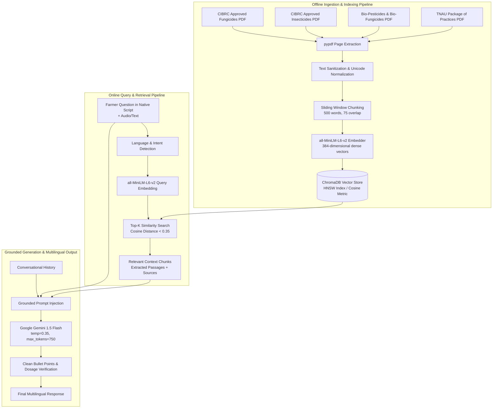

# 🌾 RAG Agronomic Chatbot — Technical Documentation

## 1. Overview & Objectives

**Kisan Salahkar (किसान सलाहकार / कृषी सल्लागार)** is a Retrieval-Augmented Generation (RAG) conversational agent engineered specifically for Indian farmers and Agriculture Extension Officers. 

The chatbot addresses three critical limitations of standard LLMs in agriculture:
1. **Hallucination Prevention**: Restricts chemical recommendations and dosages to officially registered government packages of practices.
2. **Hyper-Localized Agronomy**: Retrieves crop management guidelines specific to Indian agro-climatic zones (e.g., TNAU, ICAR, CIBRC).
3. **Multilingual Inclusivity**: Supports 11 Indian languages (Hindi, Marathi, Gujarati, Bengali, Tamil, Telugu, Punjabi, Kannada, Malayalam, Assamese, and English) with voice-ready, concise, conversational syntax.

---

## 2. End-to-End Pipeline Architecture



---

## 3. Knowledge Base Ingestion Details

The vector database is compiled from official government publications stored in `crop-disease/`:
* `2._chemical_mup_fungicide_as_on_31.03.2026_0.pdf`: Central Insecticides Board & Registration Committee (CIBRC) approved chemical fungicides.
* `3._bio_pesticide_mup_biofungicide_as_on_31.03.2026.pdf`: Registered bio-fungicides (Trichoderma, Pseudomonas).
* `4._herbicides_mup_as_on_31.03.2026.pdf`: Approved selective & non-selective herbicides.
* `5._pgr_mup_as_on_31.03.2026.pdf`: Plant Growth Regulators & Micronutrient dosages.
* `6._mup_bio_insecticide_31.03.2026.pdf`: Registered bio-insecticides (Neem, Bacillus thuringiensis, Beauveria).
* `updated_mup_insecticide_as_on_31.03.2026_c.pdf`: Major Use Pesticides (MUP) schedule.
* `HORTICULTURE.pdf`: Tamil Nadu Agricultural University (TNAU) package of agronomic practices.

### Chunking Strategy (`build_rag_index.py`)
* **Window Size:** 500 words per chunk.
* **Overlap:** 75 words to preserve sentence continuity and chemical dilution tables.
* **Metadata Tagging:** Each chunk stores `source`, `category` (e.g., *Chemical Fungicides*, *Bio Insecticides*), and `page` number.

---

## 4. Query Flow & Context Grounding

When a query is received at `/ask`:
1. **Normalization**: Language parameters (`hi`, `mr`, `en`, etc.) and optional crop disease context (`[Crop Context: ...]`) are extracted.
2. **Dense Vector Search**: The question is encoded using `all-MiniLM-L6-v2` and matched against ChromaDB's HNSW cosine index.
3. **Prompt Augmentation**: The retrieved passages are injected directly into the Gemini 1.5 Flash system prompt:
   ```text
   AUTHORITATIVE GOVERNMENT AGRONOMIC REFERENCES:
   [Extracted CIBRC / TNAU dosage passages]
   ```
4. **Structured Response Generation**:
   * **Issue Identification**: Diagnosis summary and spread risk.
   * **Organic Remedy**: Neem oil, bio-agents, mechanical roguing.
   * **Exact Chemical Dosage**: Formulation (WP/EC/SC) and water ratio (g or ml per liter).
   * **Irrigation & Weather Precautions**: Critical application windows.

---

## 5. Resilience & Multi-Tier Fallback

If upstream vector dependencies or LLM APIs are unreachable:
1. **Tier 1 (Vector RAG + Gemini 1.5 Flash)**: Full document retrieval and generation.
2. **Tier 2 (Direct Serverless Gemini 1.5 Flash)**: Direct generation via Next.js `/api/chat` using native Google Generative AI REST endpoints.
3. **Tier 3 (Native Multi-Lingual Agronomic Knowledge Base)**: Deterministic, high-accuracy response tables across Hindi, Marathi, Gujarati, Bengali, Tamil, Telugu, Punjabi, and English for 100+ common agricultural queries.
